# Hello, folks! 
 
My name is Robin Ingelbrecht and I'm an open source (web) developer at heart and always try to up my game by challenging myself and those around me.
Obviously, I'm also into gaming 🎮.

[](https://linkedin.com/in/robin-ingelbrecht) 
[](https://ingelbrechtrobin.medium.com/) 

If you like what I'm doing, please consider supporting me 🙏

<a href="https://www.buymeacoffee.com/ingelbrecht" target="_blank"></a>

## :wrench: Technologies & Tools


<!--START_SECTION:commits-per-day-time-->
**I&#039;m an Early 🐤**

```text
🌞 Morning                 1896 commits     ███████░░░░░░░░░░░░░░░░░░   26.58 %
🌆 Daytime                 2814 commits     ██████████░░░░░░░░░░░░░░░   39.46 %
🌃 Evening                 2087 commits     ███████░░░░░░░░░░░░░░░░░░   29.26 %
🌙 Night                   335 commits      █░░░░░░░░░░░░░░░░░░░░░░░░   4.70 %
```
<!--END_SECTION:commits-per-day-time-->

<!--START_SECTION:commits-per-weekday-->
**📅 I&#039;m Most Productive on Sunday**

```text
Monday                    1155 commits     ████░░░░░░░░░░░░░░░░░░░░░   16.19 %
Tuesday                   1000 commits     ████░░░░░░░░░░░░░░░░░░░░░   14.02 %
Wednesday                 963 commits      ███░░░░░░░░░░░░░░░░░░░░░░   13.50 %
Thursday                  948 commits      ███░░░░░░░░░░░░░░░░░░░░░░   13.29 %
Friday                    1005 commits     ████░░░░░░░░░░░░░░░░░░░░░   14.09 %
Saturday                  846 commits      ███░░░░░░░░░░░░░░░░░░░░░░   11.86 %
Sunday                    1215 commits     ████░░░░░░░░░░░░░░░░░░░░░   17.04 %
```
<!--END_SECTION:commits-per-weekday-->

<!--START_SECTION:most-recent-commits-->
**⏳ Most recent commits**
                                        
```text
03-12-2023  strava-activities           Updated strava activities
03-12-2023  strava-activities           Updated strava activities
03-12-2023  strava-activities           Updated template to latest version
03-12-2023  strava-activities           Updated template to latest version
03-12-2023  strava-activities-template  Merge pull request #140 from robiningelbrecht/move-templates  Better calorie svg
03-12-2023  strava-activities-template  Merge branch &#039;master&#039; into move-templates
03-12-2023  strava-activities-template  Better calory svg
03-12-2023  playstation-easy-platinums  Added 14 new games to list: Criss Cross (PS4), Settris (PS4), Settris (PS4), Stroke the Animals (PS5), Criss Cross (PS4), Totally Normal Journey (PS5), Runnyk (EU • PS4), Little Mouse&#039;s Encyclopedia (NA • PS4), White Wings (PS4), Anime Dream (PS4), The Traveler&#039;s Path (PS5), The Traveler&#039;s Path (PS4), The Perplexing Orb: Bounce N&#039; Roll (EU • PS4), The Traveler&#039;s Path (PS4)
03-12-2023  strava-activities-template  Merge pull request #139 from robiningelbrecht/move-templates  Move templates
03-12-2023  strava-activities-template  Move templates
```
<!--END_SECTION:most-recent-commits-->

## :pencil: Latest blog posts

<a target="_blank" href="https://ingelbrechtrobin.medium.com/"></a>

## :jigsaw: Let's solve this Rubik's cube

<table>
  <tr>
    <td colspan="5">
      
    </td>
    <td colspan="5">
      
    </td>
  </tr>
  <tr>
    <td align="center">
      <a href="https://puzzle-generator.robiningelbrecht.be/github-game/turn/R">R</a>
    </td>
    <td align="center">
      <a href="https://puzzle-generator.robiningelbrecht.be/github-game/turn/U">U</a>
    </td>
    <td align="center">
      <a href="https://puzzle-generator.robiningelbrecht.be/github-game/turn/F">F</a>
    </td>
    <td align="center">
      <a href="https://puzzle-generator.robiningelbrecht.be/github-game/turn/L">L</a>
    </td>
    <td align="center">
      <a href="https://puzzle-generator.robiningelbrecht.be/github-game/turn/D">D</a>
    </td>
    <td align="center">
      <a href="https://puzzle-generator.robiningelbrecht.be/github-game/turn/B">B</a>
    </td>
    <td>
       &nbsp; &nbsp;
    </td>
    <td align="center">
      <a href="https://puzzle-generator.robiningelbrecht.be/github-game/turn/M">M</a>
    </td>
    <td align="center">
      <a href="https://puzzle-generator.robiningelbrecht.be/github-game/turn/E">E</a>
    </td>
    <td align="center">
      <a href="https://puzzle-generator.robiningelbrecht.be/github-game/turn/S">S</a>
    </td>
  </tr>
  <tr>
    <td align="center">
      <a href="https://puzzle-generator.robiningelbrecht.be/github-game/turn/R&#039;">R&#039;</a>
    </td>
    <td align="center">
      <a href="https://puzzle-generator.robiningelbrecht.be/github-game/turn/U&#039;">U&#039;</a>
    </td>
    <td align="center">
      <a href="https://puzzle-generator.robiningelbrecht.be/github-game/turn/F&#039;">F&#039;</a>
    </td>
    <td align="center">
      <a href="https://puzzle-generator.robiningelbrecht.be/github-game/turn/L&#039;">L&#039;</a>
    </td>
    <td align="center">
      <a href="https://puzzle-generator.robiningelbrecht.be/github-game/turn/D&#039;">D&#039;</a>
    </td>
    <td align="center">
      <a href="https://puzzle-generator.robiningelbrecht.be/github-game/turn/B&#039;">B&#039;</a>
    </td>
     <td>
      &nbsp; &nbsp;
    </td>
    <td align="center">
      <a href="https://puzzle-generator.robiningelbrecht.be/github-game/turn/M&#039;">M&#039;</a>
    </td>
    <td align="center">
      <a href="https://puzzle-generator.robiningelbrecht.be/github-game/turn/E&#039;">E&#039;</a>
    </td>
    <td align="center">
      <a href="https://puzzle-generator.robiningelbrecht.be/github-game/turn/S&#039;">S&#039;</a>
    </td>
  </tr>
</table>

## :bike: Latest Strava activities

<!--START_SECTION:strava-activities-->
<table>
    <tr>
        <th></th>
        <th></th>
        <th align="center"></th>
        <th align="center"></th>
        <th align="center"></th>
        <th align="center"></th>
        <th align="center"></th>
        <th align="center"></th>
    </tr>
            <tr>
            <td>02-12-23</td>
            <td>
                
                <a href="https://www.strava.com/activities/10320638309" title="Kcal: 315 | Gear: None ">Dinner 🍽️ 🍕</a>
            </td>
            <td align="center">12 <sup><sub>km</sub></sup></td>
            <td align="center">31 <sup><sub>m</sub></sup></td>
            <td align="center">42:13</td>
            <td align="center">52 <sup><sub>w</sub></sup></td>
            <td align="center">17.6 <sup><sub>km/h</sub></sup></td>
            <td align="center">114</td>
        </tr>
            <tr>
            <td>02-12-23</td>
            <td>
                
                <a href="https://www.strava.com/activities/10316770449" title="Kcal: 761 | Gear: None ">Zone 2 in Watopia</a>
            </td>
            <td align="center">52 <sup><sub>km</sub></sup></td>
            <td align="center">79 <sup><sub>m</sub></sup></td>
            <td align="center">1:30:24</td>
            <td align="center">147 <sup><sub>w</sub></sup></td>
            <td align="center">34.2 <sup><sub>km/h</sub></sup></td>
            <td align="center">135</td>
        </tr>
            <tr>
            <td>02-12-23</td>
            <td>
                
                <a href="https://www.strava.com/activities/10315481314" title="Kcal: 161 | Gear: None ">Lunch Ride ❄️</a>
            </td>
            <td align="center">7 <sup><sub>km</sub></sup></td>
            <td align="center">4 <sup><sub>m</sub></sup></td>
            <td align="center">23:19</td>
            <td align="center">53 <sup><sub>w</sub></sup></td>
            <td align="center">17.6 <sup><sub>km/h</sub></sup></td>
            <td align="center">106</td>
        </tr>
            <tr>
            <td>01-12-23</td>
            <td>
                
                <a href="https://www.strava.com/activities/10311834483" title="Kcal: 185 | Gear: None ">Cooldown in Watopia</a>
            </td>
            <td align="center">13 <sup><sub>km</sub></sup></td>
            <td align="center">52 <sup><sub>m</sub></sup></td>
            <td align="center">25:11</td>
            <td align="center">129 <sup><sub>w</sub></sup></td>
            <td align="center">31.4 <sup><sub>km/h</sub></sup></td>
            <td align="center">148</td>
        </tr>
            <tr>
            <td>01-12-23</td>
            <td>
                
                <a href="https://www.strava.com/activities/10311723468" title="Kcal: 679 | Gear: None ">Race: Race #2 | Cobbled Cl...</a>
            </td>
            <td align="center">28 <sup><sub>km</sub></sup></td>
            <td align="center">404 <sup><sub>m</sub></sup></td>
            <td align="center">46:25</td>
            <td align="center">234 <sup><sub>w</sub></sup></td>
            <td align="center">36.3 <sup><sub>km/h</sub></sup></td>
            <td align="center">183</td>
        </tr>
                <tr>
            <td colspan="8" align="right"><a href="https://github.com/robiningelbrecht/strava-activities#activities">View all activities</a></td>
        </tr>
    </table>

<!--END_SECTION:strava-activities-->

 ## :sparkles: GitHub Trophies




